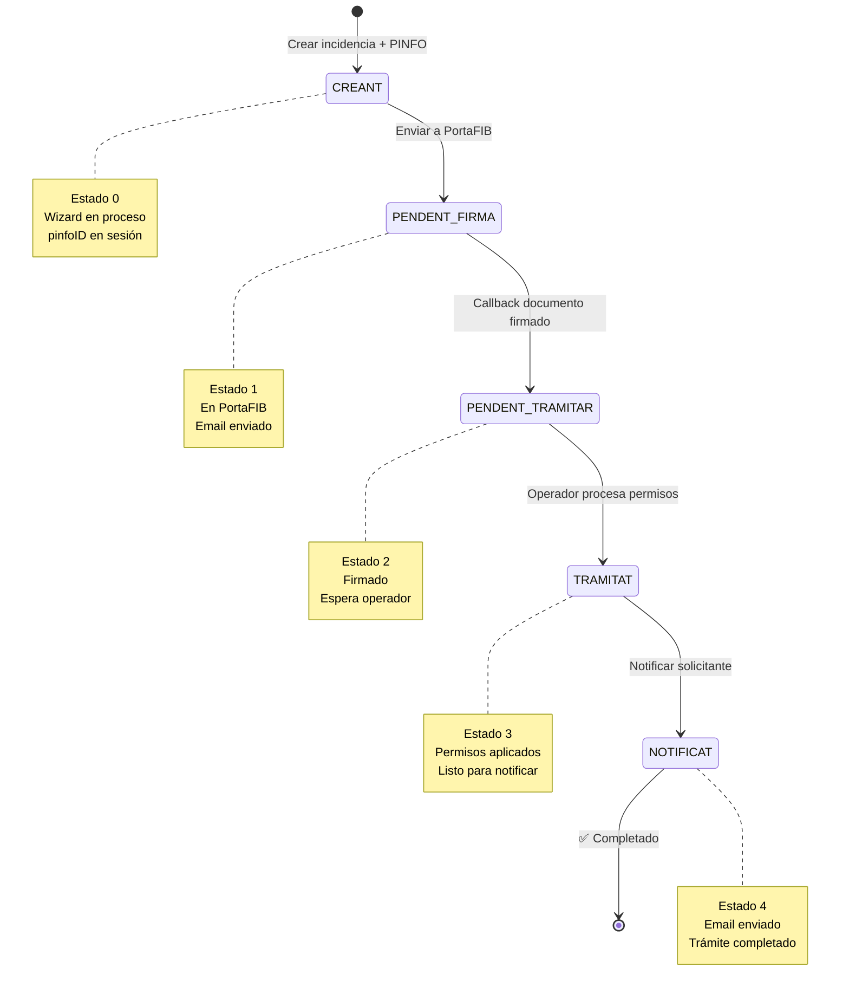

# TRÁMITE PINFO - Referencia Completa

## 🎯 QUÉ ES

Sistema de **gestión de permisos de usuarios** para acceder a procedimientos y servicios en Pinbal.
- **Acceso:** Público (con token) + Operadores internos
- **Flujo:** Solicitud → Firma digital → Procesamiento → Notificación
- **Resultado:** Permisos aplicados en base de datos Pinbal

---

## � ACTORES DEL SISTEMA

1. **Solicitante (usuario externo):**
   - Fases 1-8: Crea solicitud y envía a firmar
   - Fase 12: Recibe notificación con resultado

2. **Responsable/Firmante (PFI_USER):**
   - Fase 9: Firma digitalmente el documento en PortaFIB

3. **Operador (interno):**
   - Fase 10: Procesa permisos (aplica en Pinbal)
   - Fase 11: Marca como tramitado
   - Fase 12: Notifica al solicitante

4. **Sistema PortaFIB:**
   - Fase 8: Recibe documento para firma
   - Fase 9: Envía callback con documento firmado

---

## 📊 DIAGRAMA DE ESTADOS



**Estados Numéricos:**
```
Pinfo:
 0 = CREANT (wizard en proceso)
 1 = PENDENT_FIRMA (en PortaFIB)
 2 = PENDENT_TRAMITAR (firmado, espera operador)
 3 = TRAMITAT (permisos aplicados)
 4 = NOTIFICAT (email enviado) ✅

IncidenciaTecnica:
11 = PINFO_PENDENT_FIRMA (10 + 1)
12 = PINFO_PENDENT_TRAMITAR (10 + 2)
13 = PINFO_TRAMITAT (10 + 3)
14 = PINFO_NOTIFICAT (10 + 4)
```

---

## 📋 LAS 12 FASES DETALLADAS

### PARTE PÚBLICA (Usuario Externo)

#### **FASE 1: Entrada Token**
**URL:** `/public/incidenciapinfo/new/{token}`  
**Controlador:** `IncidenciaPinfoPublicController`  
**Vista:** N/A (redirección automática)

**Proceso:**
1. Lee archivo `.front` del servidor con datos precargados
2. Guarda propiedades en sesión (organid, contacte, etc.)
3. Redirecciona a `/public/incidenciapinfo/new`

**Estado:** No hay PINFO todavía

---

#### **FASE 2: Crear Incidencia**
**URLs:**
- GET `/public/incidenciapinfo/new` - Mostrar formulario
- POST `/public/incidenciapinfo/new` - Crear incidencia + PINFO

**Controlador:** `IncidenciaPinfoPublicController`  
**Vista:** `incidenciaTecnicaForm.jsp`

**Formulario:**
- Título de la incidencia
- Órgano gestor (organ)
- Contacto (nombre, teléfono, email)
- Descripción

**Proceso:**
```java
// Crear IncidenciaTecnica
IncidenciaTecnica incidencia = incidenciaTecnicaLogicaEjb.create(...);

// Crear Pinfo asociado
PinfoJPA pinfo = new PinfoJPA(
    incidencia.getId(),
    entitat,
    solicitantNIF,
    solicitantNom,
    Constants.ESTAT_PINFO_CREANT  // Estado 0
);
Pinfo pinfoCreado = pinfoLogicaEjb.create(pinfo);

// ⚠️ CRÍTICO: Guardar en sesión
session.setAttribute("pinfoID", pinfoCreado.getPinfoID());
session.setAttribute("incidenciaId", incidencia.getId());
session.setAttribute("usuariNIF", solicitantNIF);
session.setAttribute("usuariNom", solicitantNom);
```

**Estados:**
- IncidenciaTecnica: `ESTAT_INCIDENCIA_PINFO_PENDENT_FIRMA` (11)
- Pinfo: `ESTAT_PINFO_CREANT` (0)

**Redirección:** → `/public/pinfodata/elegirTipo`

---

#### **FASE 3: Elegir Tipo**
**URLs:**
- GET `/public/pinfodata/elegirTipo` - Mostrar elección
- GET `/public/pinfodata/crearalta` - Guardar tipo ALTA
- GET `/public/pinfodata/crearbaixa` - Guardar tipo BAJA

**Controlador:** `PinfoDataPublicController`  
**Vista:** `pinfoElegirTipo.jsp`

**Opciones:**
- **ALTA DE PERMISOS** (1) → Nuevos permisos para usuarios
- **BAIXA DE PERMISOS** (0) → Quitar permisos existentes

**Proceso:**
```java
// Guardar en sesión
session.setAttribute("ALTA_BAIXA", 1L); // o 0L
```

**Impacto:** Determina qué servicios se mostrarán en el wizard (solo no activos para ALTA, solo activos para BAJA)

**Redirección:** → `/public/pinfodata/new` (wizard)

---

#### **FASE 4: Wizard 3 Pasos**
**URLs:**
- GET `/public/pinfodata/new` - Mostrar wizard
- POST `/public/pinfodata/procesarPermisos` - Crear registros PinfoData
- AJAX GET `/jsonUsuaris?search={texto}` - Buscar usuarios
- AJAX GET `/jsonProcediments?search={texto}&entitat={id}` - Buscar procedimientos
- AJAX GET `/jsonServeisProcediment?procedimentID={id}&alta_baixa={0|1}` - Listar servicios

**Controlador:** `PinfoDataPublicController`  
**Vista:** `tramitPinfoForm.jsp`

**PASO 1: Seleccionar Usuarios**
- Autocomplete con búsqueda AJAX
- Busca usuarios en Pinbal por NIF, código o nombre
- Permite añadir múltiples usuarios
- Se almacenan en lista temporal en el formulario

**PASO 2: Seleccionar Procedimientos**
- Autocomplete con búsqueda AJAX
- Busca procedimientos de la entidad
- Permite añadir múltiples procedimientos
- Se almacenan en lista temporal

**PASO 3: Seleccionar Servicios**
- Para cada procedimiento añadido, lista sus servicios disponibles
- Servicios diferentes según sea Alta o Baja:
  - **ALTA:** Servicios NO actualmente dados de alta para el procedimiento
  - **BAJA:** Servicios que SÍ están actualmente dados de alta
- Checkboxes para seleccionar servicios deseados

**Proceso de Creación (POST /procesarPermisos):**
```java
// Leer de sesión
Long pinfoID = (Long) session.getAttribute("pinfoID");
Long alta_baixa = (Long) session.getAttribute("ALTA_BAIXA");

// Parsear formulario
String[] usuaris = request.getParameter("usuaris").split(",");
String[] serveis = request.getParameter("solicitudServeis").split(",");

// Crear PinfoData: usuario × servicio
for (String usuariCodi : usuaris) {
    for (String serveiID : serveis) {
        PinfoDataJPA pinfoData = new PinfoDataJPA(
            pinfoID,           // FK al PINFO
            0L,                // Estado inicial
            usuariCodi,        // Código usuario
            procedimentID,     // FK procedimiento
            Long.parseLong(serveiID), // FK servicio
            alta_baixa         // 1=alta, 0=baja
        );
        pinfoDataLogicaEjb.create(pinfoData);
    }
}
```

**Resultado:** N registros de `PinfoData` (matriz usuario × servicio)

**Redirección:** → `/public/pinfodata/list`

---

#### **FASE 5: Listar Permisos**
**URL:** GET `/public/pinfodata/list`  
**Controlador:** `PinfoDataPublicController`  
**Vista:** `tramitPinfoList.jsp`

**Proceso:**
```java
// Obtener estructura completa
PinfoDataFull pinfoDataFull = 
    pinfoDataLogicaEjb.getEstructuraUsuarisProcedimentServeis(pinfoID);
```

**Muestra estructura jerárquica:**
```
Usuario A (NIF, Nombre)
  ├─ Procedimiento 1
  │   ├─ Servicio A
  │   ├─ Servicio B
  │   └─ Servicio C
  └─ Procedimiento 2
      └─ Servicio D
Usuario B
  └─ ...
```

**Funcionalidades:**
- Eliminar servicios individuales
- Indicador ALTA/BAIXA en el título
- Resumen de permisos totales

**Botones:**
- **Eliminar** (cada servicio individual)
- **Següent** → Continuar a seleccionar responsable

**Redirección:** → `/public/pinfodata/seleccionarResponsable`

---

#### **FASE 6: Seleccionar Responsable**
**URLs:**
- GET `/public/pinfodata/seleccionarResponsable` - Mostrar lista
- POST `/public/pinfodata/seleccionarResponsable` - Guardar selección

**Controlador:** `PinfoDataPublicController`  
**Vista:** `seleccionarResponsable.jsp`

**Proceso:**
```java
// Obtener usuarios con rol PFI_USER del LDAP
UserInformation plugin = new UserInformation(...);
UserInfo[] usuarisPFIUSER = plugin.getUserInfoByRol("PFI_USER");

// Usuario selecciona un responsable (NIF)
// POST
UserInfo responsable = plugin.getUserInfoByAdministrationID(responsableNIF);

// Guardar en el Pinfo
pinfo.setDestinatariNIF(responsableNIF);
pinfo.setDestinatariNom(responsable.getFullName());
pinfoLogicaEjb.update(pinfo);
```

**Función del Responsable:** Será quien firme digitalmente el documento en PortaFIB

**Redirección:** → `/public/pinfodata/generaPdf`

---

#### **FASE 7: Generar PDF**
**URL:** GET `/public/pinfodata/generaPdf`  
**Controlador:** `PinfoDataPublicController`  
**Vista:** `showPinfoPdf.jsp`

**Proceso:**
```java
// Generar PDF con todos los permisos solicitados
Long fitxerID = pinfoLogicaEjb.generarPinfoPDF(pinfoID);
pinfo.setFitxerID(fitxerID);
pinfoLogicaEjb.update(pinfo);
```

**Contenido del PDF:**
- Datos del solicitante
- Datos del responsable
- Lista completa de permisos:
  - Usuarios
  - Procedimientos
  - Servicios
  - Tipo (Alta/Baja)

**Botones:**
- **Descarregar PDF** - Ver el documento
- **Firmar i Enviar** → Enviar a PortaFIB

**Redirección:** → `/public/pinfo/enviarPinfoPortaFIB/{pinfoID}`

---

#### **FASE 8: Enviar PortaFIB**
**URL:** GET `/public/pinfo/enviarPinfoPortaFIB/{pinfoID}`  
**Controlador:** `PinfoPublicController`  
**Vista final:** `pinfoEnviadoConfirmacion.jsp`

**Proceso:**
```java
pinfoLogicaEjb.enviarPinfoPortaFIB(pinfoID);

// En PinfoLogicaEJB.enviarPinfoPortaFIB()
// 1. Crear flujo de firma en PortaFIB
Long portafibID = PortafibUtils.crearFluxoFirma(
    destinatariNIF,
    fitxerID,
    "Solicitud PINFO " + pinfoID
);

// 2. Guardar portafibID
pinfo.setPortafibid(portafibID);
pinfo.setEstat(Constants.ESTAT_PINFO_PENDENT_FIRMA); // Estado 1
pinfoLogicaEjb.update(pinfo);

// 3. Actualizar incidencia
incidencia.setEstat(Constants.ESTAT_INCIDENCIA_PINFO_PENDENT_FIRMA); // Estado 11

// 4. Enviar email de confirmación al solicitante
eventLogicaEjb.create(...,
    asumpte: "PINFO " + pinfoID + " enviat a Portafib",
    missatge: "Se ha enviado a firmar...",
    destinatariEmail: solicitanteEmail
);
```

**Estados:**
- Pinfo: `ESTAT_PINFO_PENDENT_FIRMA` (1)
- IncidenciaTecnica: `ESTAT_INCIDENCIA_PINFO_PENDENT_FIRMA` (11)

**Email enviado:** Confirmación al solicitante

**Redirección:** → `/public/pinfo/confirmacionEnviado/{pinfoID}`

---

### FIRMA DIGITAL

#### **FASE 9: Callback PortaFIB**
**URL:** POST `/public/cbrest/v1/event`  
**Servicio:** `PortaFIBCallbackRestService` (API REST interna)

**Proceso:**
```java
// PortaFIB envía callback cuando el documento es firmado
switch (event.getType()) {
    case NOTIFICACIOAVIS_PETICIO_FIRMADA:
        Long portafibID = event.getSigningRequest().getID();
        Long pinfoID = pinfoLogicaEjb.cosesAFerPinfoFirmat(portafibID);
        break;
}

// En PinfoLogicaEJB.cosesAFerPinfoFirmat()
// 1. Descargar fichero firmado de PortaFIB
FirmaAsyncSimpleSignedFile fitxerFirmat = 
    PortafibUtils.getFitxerSignat(portafibID);

// 2. Guardar fichero firmado
Long fitxerFirmatID = PortafibUtils.guardarFitxer(fitxerFirmat, ...);

// 3. Actualizar Pinfo
pinfo.setFitxerfirmatID(fitxerFirmatID);
pinfo.setEstat(Constants.ESTAT_PINFO_PENDENT_TRAMITAR); // Estado 2
pinfoLogicaEjb.update(pinfo);

// 4. Actualizar IncidenciaTecnica
incidencia.setEstat(Constants.ESTAT_INCIDENCIA_PINFO_PENDENT_TRAMITAR); // Estado 12

// 5. Crear evento
eventLogicaEjb.create(...,
    asumpte: "Guardat Fitxer Firmat",
    missatge: "S'ha rebut el pinfo firmat de Portafib",
    persona: destinatariNom
);
```

**Estados:**
- Pinfo: `ESTAT_PINFO_PENDENT_TRAMITAR` (2) ⬅️ Esperando que operador lo procese
- IncidenciaTecnica: `ESTAT_INCIDENCIA_PINFO_PENDENT_TRAMITAR` (12)

**Evento creado:** Registro interno del documento firmado recibido

---

### PARTE INTERNA (Operador)

#### **FASE 10: Processar Permisos**
**URL:** GET `/operador/pinfo/procesarPinfo/{pinfoID}`  
**Controlador:** `PinfoOperadorController`  
**Vista:** `pinfoOperadorForm.jsp`

**Acceso:** Solo operadores internos (no público)

**Proceso:**
```java
pinfoDataLogicaEjb.procesarPermisosPinfo(pinfoID);

// En PinfoDataLogicaEJB.procesarPermisosPinfo()
// 1. Obtener todos los PinfoData del PINFO
List<PinfoData> pinfoDatas = this.select(
    PinfoDataFields.PINFOID.equal(pinfoID)
);

// 2. Conectar con Pinbal API REST
ProcedimentClient procClient = new ProcedimentClient(...);
ServeiClient serveiClient = new ServeiClient(...);

StringBuilder logTecnico = new StringBuilder();
StringBuilder logUsuario = new StringBuilder();
int liniesOK = 0;
int liniesError = 0;

// 3. Para cada permiso solicitado
for (PinfoData pinfoData : pinfoDatas) {
    try {
        // Validar que procedimiento existe
        Procediment proc = procClient.getProcediment(procCodi, entitat);
        
        // Validar que servicio existe
        Servei servei = serveiClient.getServei(serveiCodi);
        
        // ⭐ Habilitar servicio para el procedimiento
        procClient.enableServeiToProcediment(proc.getId(), servei.getCodi());
        
        // Log OK
        logTecnico.append("✓ Usuario: " + usuariid + 
                         " Proc: " + procCodi + 
                         " Servei: " + serveiCodi + " - OK\n");
        logUsuario.append("<span style='color:green'>✓</span> " + 
                         serveiNom + " - Alta correcta<br>");
        liniesOK++;
        
    } catch (Exception e) {
        // Log ERROR
        logTecnico.append("✗ ERROR: " + e.getMessage() + "\n");
        logUsuario.append("<span style='color:red'>✗</span> " + 
                         serveiNom + " - ERROR: " + e.getMessage() + "<br>");
        liniesError++;
    }
}

// 4. Generar mensaje HTML para el solicitante
String missatgeSolicitant = generarMissatgeHTML(logUsuario, liniesOK, liniesError);

// 5. Guardar en Pinfo
pinfo.setMissatgePinbal(logTecnico.toString());      // Log detallado para operador
pinfo.setMissatgeSolicitant(missatgeSolicitant);     // Mensaje amigable para usuario
pinfoLogicaEjb.update(pinfo);
```

**Resultado:**
- Permisos aplicados en Pinbal
- Dos mensajes generados:
  - `missatgePinbal`: Log técnico detallado (para operador)
  - `missatgeSolicitant`: Mensaje HTML amigable (para usuario)
- Estado sigue en `PENDENT_TRAMITAR` (2)

**Vista operador después:** Muestra botón "Marcar com Tramitat"

---

#### **FASE 11: Marcar Tramitat**
**URL:** GET `/operador/pinfo/marcarComTramitat/{pinfoID}`  
**Controlador:** `PinfoOperadorController`

**Proceso:**
```java
pinfoDataLogicaEjb.marcarPinfoComTramitat(pinfoID);

// En PinfoDataLogicaEJB.marcarPinfoComTramitat()
// Actualizar estado del Pinfo
pinfo.setEstat(Constants.ESTAT_PINFO_TRAMITAT); // Estado 3
pinfoLogicaEjb.update(pinfo);

// Actualizar estado de la IncidenciaTecnica
incidencia.setEstat(Constants.ESTAT_INCIDENCIA_PINFO_TRAMITAT); // Estado 13
incidenciaTecnicaLogicaEjb.update(incidencia);
```

**Estados:**
- Pinfo: `ESTAT_PINFO_TRAMITAT` (3) ⬅️ Listo para notificar al solicitante
- IncidenciaTecnica: `ESTAT_INCIDENCIA_PINFO_TRAMITAT` (13)

**Vista operador después:** Muestra botón "Enviar Missatge al Solicitant"

---

#### **FASE 12: Notificar**
**URL:** GET `/operador/pinfo/enviarMissatgeSolicitant/{pinfoID}`  
**Controlador:** `PinfoOperadorController`

**Proceso:**
```java
UserInfo operador = LoginInfo.getInstance().getUserInfo();
pinfoLogicaEjb.enviarMissatgeSolicitant(operador, pinfoID);

// En PinfoLogicaEJB.enviarMissatgeSolicitant()
// 1. Obtener mensaje generado en Fase 10
String missatgeSolicitant = pinfo.getMissatgeSolicitant();

// 2. Crear email para el contacto
String msg = "Bon dia, " + contacteNom + "<br><br>" 
    + "Hem tramitat la seva sol·licitud (PINFO " + pinfoID + "):<br><br>"
    + "<div style='border:1px solid #ccc; padding:.5rem;'>"
    + missatgeSolicitant 
    + "</div><br>"
    + "Salutacions cordials,<br>" 
    + operador.getFullName() + ", Fundació BIT";

// 3. Crear evento en el histórico (envía email automáticamente)
eventLogicaEjb.create(
    solicitudID: null,
    incidenciaTecnicaID: incidencia.getId(),
    tipus: Constants.EVENT_TIPUS_COMENTARI_TRAMITADOR_PUBLIC,
    asumpte: "Pinfo " + pinfoID + " Tramitat",
    missatge: msg,
    destinatari: contacteNom,
    destinatariEmail: contacteEmail,
    noLlegit: false  // Email enviado automáticamente
);

// 4. Actualizar estados finales
pinfo.setEstat(Constants.ESTAT_PINFO_NOTIFICAT); // Estado 4 ✅ FINAL
incidencia.setEstat(Constants.ESTAT_INCIDENCIA_PINFO_NOTIFICAT); // Estado 14
incidencia.setOperador(operador.getUsername());
```

**Estados FINALES:**
- Pinfo: `ESTAT_PINFO_NOTIFICAT` (4) ✅ **TRÁMITE COMPLETADO**
- IncidenciaTecnica: `ESTAT_INCIDENCIA_PINFO_NOTIFICAT` (14)

**Email enviado:**
- Destinatario: Contacto de la incidencia
- Asunto: Pinfo {pinfoID} Tramitat
- Contenido: Resultado de la tramitación (permisos aplicados o errores)

**Evento creado:** Registro del envío de notificación

---

## �️ ESTRUCTURA DE DATOS

### Entidades Principales

#### **IncidenciaTecnica**
```
incidenciaTecnicaID (PK)
titol                    // Título de la incidencia
organid (FK → Organ)     // Órgano gestor
contacteNom              // Nombre del contacto
contacteTelefon          // Teléfono del contacto
contacteEmail            // Email del contacto
descripcio               // Descripción de la incidencia
estat                    // Estado (11-14 para PINFOs)
operador                 // Username del operador que tramitó
```

#### **Pinfo** (la solicitud)
```
pinfoID (PK)
incidenciaID (FK → IncidenciaTecnica)
entitat                  // Código entidad
solicitantNIF            // NIF quien solicita
solicitantNom            // Nombre quien solicita
estat                    // Estado (0-4)
destinatariNIF           // NIF responsable firmante
destinatariNom           // Nombre responsable firmante
fitxerID (FK → Fitxer)   // PDF generado
fitxerfirmatID           // PDF firmado
portafibid               // ID flujo PortaFIB
missatgePinbal           // Log técnico para operador
missatgeSolicitant       // Mensaje HTML para usuario
```

#### **PinfoData** (permisos individuales)
```
pinfodataID (PK)
pinfoID (FK → Pinfo)
usuariid                 // Código usuario Pinbal
procedimentID (FK → Solicitud)
serveiID (FK → Servei)
alta                     // 1=Alta, 0=Baja
estat                    // Estado del permiso
```

### Relaciones
```
1 IncidenciaTecnica
    ↓
1 Pinfo
    ↓
N PinfoData (usuario × servicio)
```

---

## 🔑 DATOS EN SESIÓN (CRÍTICOS)

```java
session.attributes:
- "token"          // Token de entrada
- "properties"     // Datos del archivo .front
- "incidenciaId"   // ID de la incidencia técnica
- "pinfoID"        // ⚠️ CRÍTICO: ID del PINFO
- "ALTA_BAIXA"     // 1=Alta, 0=Baja
- "usuariNIF"      // NIF del solicitante
- "usuariNom"      // Nombre del solicitante
```

**Impacto de `pinfoID` null:**
Si `pinfoID` no está en sesión, todo el wizard falla porque no se puede asociar los `PinfoData` al `Pinfo` correcto.

**Fix aplicado en Fase 2:**
```java
session.setAttribute("pinfoID", pinfo.getPinfoID());
```

---

## 🎛️ CONTROLADORES Y SERVICIOS

### Controladores

#### **IncidenciaPinfoPublicController**
- **Base URL:** `/public/incidenciapinfo`
- **Fase:** 1-2 (Entrada token y crear incidencia)
- **Métodos clave:**
  - `newWithToken()` - Lee archivo .front
  - `create()` - Crea IncidenciaTecnica + Pinfo

#### **PinfoDataPublicController**
- **Base URL:** `/public/pinfodata`
- **Fases:** 3-7 (Wizard completo hasta PDF)
- **Métodos clave:**
  - `elegirTipo()` - Mostrar elección Alta/Baja
  - `wizardForm()` - Mostrar wizard 3 pasos
  - `procesarPermisos()` - Crear registros PinfoData
  - `list()` - Listar permisos solicitados
  - `seleccionarResponsable()` - Seleccionar firmante
  - `generaPdf()` - Generar PDF
- **AJAX Endpoints:**
  - `/jsonUsuaris` - Buscar usuarios Pinbal
  - `/jsonProcediments` - Buscar procedimientos
  - `/jsonServeisProcediment` - Listar servicios por procedimiento

#### **PinfoPublicController**
- **Base URL:** `/public/pinfo`
- **Fase:** 8 (Envío a PortaFIB)
- **Métodos clave:**
  - `enviarPinfoPortaFIB()` - Enviar a firma digital
  - `confirmacionEnviado()` - Página de confirmación

#### **PortaFIBCallbackRestService**
- **Base URL:** `/public/cbrest/v1`
- **Fase:** 9 (Callback firma)
- **Métodos clave:**
  - `event()` - Recibir callback de PortaFIB
  - Llama a `PinfoLogicaEJB.cosesAFerPinfoFirmat()`

#### **PinfoOperadorController**
- **Base URL:** `/operador/pinfo`
- **Fases:** 10-12 (Procesamiento interno)
- **Métodos clave:**
  - `view()` - Ver detalle PINFO
  - `procesarPinfo()` - Procesar permisos
  - `marcarComTramitat()` - Marcar tramitado
  - `enviarMissatgeSolicitant()` - Enviar notificación final

### EJBs (Lógica de Negocio)

#### **PinfoLogicaEJB**
- CRUD Pinfo
- `generarPinfoPDF()` - Generar PDF con permisos
- `enviarPinfoPortaFIB()` - Crear flujo firma
- `cosesAFerPinfoFirmat()` - Procesar callback firma
- `enviarMissatgeSolicitant()` - Notificar solicitante

#### **PinfoDataLogicaEJB**
- CRUD PinfoData
- `getEstructuraUsuarisProcedimentServeis()` - Obtener estructura jerárquica
- `procesarPermisosPinfo()` - Aplicar permisos en Pinbal
- `marcarPinfoComTramitat()` - Cambiar estado a TRAMITAT

#### **IncidenciaTecnicaLogicaEJB**
- CRUD IncidenciaTecnica
- Actualizar estados según fase

#### **EventLogicaEJB**
- Crear eventos/histórico
- Envío de emails automático

---

## 🔌 INTEGRACIONES

### 1. LDAP (UserInformation Plugin)
**Fase 6: Seleccionar Responsable**

```java
UserInformation plugin = new UserInformation(
    entidadId,
    procedimentId,
    LoginInfo.getInstance().getUserInfo()
);

// Obtener usuarios con rol PFI_USER
UserInfo[] usuarisPFIUSER = plugin.getUserInfoByRol("PFI_USER");

// Obtener info de usuario específico
UserInfo user = plugin.getUserInfoByAdministrationID(nif);
```

**Datos UserInfo:**
- `getAdministrationID()` → NIF
- `getFullName()` → Nombre completo
- `getEmail()` → Email

---

### 2. PortaFIB (Firma Digital)
**Fase 8: Enviar a Firma**

```java
// Crear flujo de firma
Long portafibID = PortafibUtils.crearFluxoFirma(
    destinatariNIF,      // Quien debe firmar
    fitxerID,            // PDF a firmar
    "Solicitud PINFO " + pinfoID
);

// Guardar ID del flujo
pinfo.setPortafibid(portafibID);
```

**Fase 9: Callback Firma**

```java
// Descargar documento firmado
FirmaAsyncSimpleSignedFile fitxerFirmat = 
    PortafibUtils.getFitxerSignat(portafibID);

// Guardar documento firmado
Long fitxerFirmatID = PortafibUtils.guardarFitxer(
    fitxerFirmat,
    fitxerPublicEjb
);

pinfo.setFitxerfirmatID(fitxerFirmatID);
```

**Callback REST:**
- Endpoint: POST `/public/cbrest/v1/event`
- Tipo evento: `NOTIFICACIOAVIS_PETICIO_FIRMADA`
- Contiene: `portafibID`, documento firmado

---

### 3. Pinbal API REST (⭐ APLICACIÓN DE PERMISOS)
**Fase 10: Procesamiento de Permisos**

```java
// Configurar clientes REST
String baseUrl = "http://pinbal-api.caib.es/api";
ProcedimentClient procClient = new ProcedimentClient(baseUrl, username, password);
ServeiClient serveiClient = new ServeiClient(baseUrl, username, password);

// Para cada permiso:
// 1. Validar procedimiento existe
Procediment proc = procClient.getProcediment(
    codiProcediment,
    codiEntitat
);

// 2. Validar servicio existe
Servei servei = serveiClient.getServei(codiServei);

// 3. ⭐ APLICAR PERMISO (método clave)
procClient.enableServeiToProcediment(
    proc.getId(),         // ID numérico del procedimiento
    servei.getCodi()      // Código del servicio
);
```

**Métodos API Pinbal:**
- `getProcediment(codi, entitat)` → Obtener procedimiento
- `getServei(codi)` → Obtener servicio
- `enableServeiToProcediment(procID, serveiCodi)` → **Habilitar servicio para procedimiento**

**Excepciones:**
- Procedimiento no existe
- Servicio no existe
- Error de conexión
- Ya está habilitado (no es error)

---

### 4. Estructura Organizativa (Plugin)
**Fase 2: Crear Incidencia**

```java
EstructuraOrganitzativa plugin = new EstructuraOrganitzativa(...);
Organ organ = plugin.getOrganById(organId);
```

Obtiene información del órgano gestor.

---

### 5. Sistema de Ficheros (Fitxer)
**Fases 7 y 9: PDF**

```java
// Generar PDF
Long fitxerID = pinfoLogicaEjb.generarPinfoPDF(pinfoID);

// Guardar PDF firmado
Long fitxerfirmatID = PortafibUtils.guardarFitxer(fitxerFirmat, fitxerPublicEjb);
```

Almacena documentos en base de datos.

---

## 🎨 VISTAS JSP

### Vistas Públicas (`/WEB-INF/jsp/all/`)

| Fase | Vista | Descripción |
|------|-------|-------------|
| 2 | `incidenciaTecnicaForm.jsp` | Formulario crear incidencia |
| 3 | `pinfoElegirTipo.jsp` | Elección Alta/Baja con botones gradiente |
| 4 | `tramitPinfoForm.jsp` | Wizard 3 pasos (usuarios, procedimientos, servicios) |
| 5 | `tramitPinfoList.jsp` | Lista jerárquica de permisos solicitados |
| 6 | `seleccionarResponsable.jsp` | Lista responsables PFI_USER |
| 7 | `showPinfoPdf.jsp` | Preview PDF generado |
| 8 | `pinfoEnviadoConfirmacion.jsp` | Confirmación envío a PortaFIB |

### Vistas Operador (`/WEB-INF/jsp/operador/`)

| Vista | Descripción |
|-------|-------------|
| `pinfoOperadorList.jsp` | Lista PINFOs pendientes tramitar |
| `pinfoOperadorForm.jsp` | Detalle PINFO con botones acción |

### Tecnologías Frontend

- **JSP + JSTL** - Plantillas y lógica de vista
- **Apache Tiles** - Composición de vistas
- **jQuery** - Manipulación DOM y AJAX
- **Bootstrap** - Framework CSS (parcial)
- **Custom CSS** - Estilos gradientes y específicos

### Componentes AJAX

**Autocomplete Usuarios:**
```javascript
$("#usuaris").autocomplete({
    source: function(request, response) {
        $.getJSON("/public/pinfodata/jsonUsuaris", {
            search: request.term
        }, response);
    },
    select: function(event, ui) {
        afegirUsuari(ui.item.value, ui.item.label);
    }
});
```

**Autocomplete Procedimientos:**
```javascript
$("#procediments").autocomplete({
    source: "/public/pinfodata/jsonProcediments",
    select: function(event, ui) {
        afegirProcediment(ui.item.value, ui.item.label);
    }
});
```

**Cargar Servicios:**
```javascript
function cargarServeis(procedimentID) {
    $.getJSON("/public/pinfodata/jsonServeisProcediment", {
        procedimentID: procedimentID,
        alta_baixa: $("#alta_baixa").val()
    }, function(data) {
        // Renderizar checkboxes
        mostrarServeis(data);
    });
}
```

---

## 📧 NOTIFICACIONES Y EMAILS

### Email Fase 8: Confirmación Envío a PortaFIB

**Destinatario:** Solicitante (email del usuario que creó la solicitud)

**Asunto:** PINFO {pinfoID} enviat a Portafib

**Contenido:**
```
S'ha enviat la sol·licitud PINFO {pinfoID} a Portafib per a la seva signatura.

Remitente: {solicitantNom} ({solicitantNIF})
Destinatari: {destinatariNom} ({destinatariNIF})

Rebràs una notificació quan la tramitació hagi finalitzat.

Salutacions cordials,
Sistema PinbalAdmin
```

**Tipo:** Evento interno (no email directo)

---

### Email Fase 12: Notificación Final (⭐ PRINCIPAL)

**Destinatario:** Contacto de la incidencia (contacteEmail)

**Asunto:** Pinfo {pinfoID} Tramitat

**Contenido:**
```html
Bon dia, {contacteNom}

Hem tramitat la seva sol·licitud (PINFO {pinfoID}):

<div style='border:1px solid #ccc; padding:.5rem; background:#f9f9f9;'>
  <h4>Usuario: {usuariNom} ({usuariNIF})</h4>
  
  <h5>Procediment: {procedimentNom}</h5>
  <ul>
    <li><span style='color:green'>✓</span> Servei A - Alta correcta</li>
    <li><span style='color:green'>✓</span> Servei B - Alta correcta</li>
    <li><span style='color:red'>✗</span> Servei C - ERROR: El servei no existeix</li>
  </ul>
  
  <h5>Procediment: {procedimentNom2}</h5>
  <ul>
    <li><span style='color:green'>✓</span> Servei D - Alta correcta</li>
  </ul>
</div>

<div style='margin-top:1rem; padding:.5rem; background:#fff3cd;'>
  <strong>ERRORS DETECTATS:</strong>
  <ul>
    <li>Servei C: El servei no existeix en el sistema</li>
  </ul>
</div>

<p style='margin-top:1rem;'>
Permisos aplicats correctament: 3<br>
Errors detectats: 1
</p>

Salutacions cordials,<br>
{operadorNom}, Fundació BIT
```

**Tipo:** Evento con email automático (`noLlegit=false`)

---

## ⚠️ PUNTOS CRÍTICOS Y FIXES

### 1. Bug Fix: pinfoID null en sesión

**Problema Original:**
```java
// NO se guardaba pinfoID en sesión
Pinfo pinfo = pinfoLogicaEjb.create(pinfoJPA);
// ❌ Faltaba: session.setAttribute("pinfoID", pinfo.getPinfoID());
```

**Síntoma:** En fase 4, al crear PinfoData, `pinfoID` era null → ERROR

**Fix Aplicado (Fase 2):**
```java
Pinfo pinfo = pinfoLogicaEjb.create(pinfoJPA);
session.setAttribute("pinfoID", pinfo.getPinfoID()); // ✅
```

**Impacto:** Sin esto, el wizard completo no funciona.

---

### 2. Manejo de Múltiples PINFOs

**Problema:** Al buscar PINFOs de un usuario, no se ordenaba por fecha

**Fix:**
```java
// ANTES: pinfos.size() > 1
// AHORA:
if (pinfos.size() >= 1) {
    // Ordenar DESC por pinfoID (más reciente primero)
    Collections.sort(pinfos, (p1, p2) -> p2.getPinfoID().compareTo(p1.getPinfoID()));
    pinfo = pinfos.get(0); // Obtener el más reciente
}
```

---

### 3. Encoding UTF-8 en Footer

**Problema:** "Fundació BIT" aparecía con caracteres raros

**Fix:**
```jsp
<%@ page contentType="text/html; charset=UTF-8" pageEncoding="UTF-8"%>
```

---

### 4. Métodos Clave con Código

#### Fase 4: Crear PinfoData
```java
// PinfoDataPublicController.procesarPermisos()
Long pinfoID = (Long) session.getAttribute("pinfoID");
Long alta_baixa = (Long) session.getAttribute("ALTA_BAIXA");

String[] usuaris = request.getParameter("usuaris").split(",");
String[] solicitudServeis = request.getParameter("solicitudServeis").split(",");

for (String usuariCodi : usuaris) {
    for (String serveiID : solicitudServeis) {
        PinfoDataJPA pd = new PinfoDataJPA(
            pinfoID,
            0L,
            usuariCodi.trim(),
            procedimentID,
            Long.parseLong(serveiID.trim()),
            alta_baixa
        );
        pinfoDataLogicaEjb.create(pd);
    }
}
```

#### Fase 9: Callback PortaFIB
```java
// PinfoLogicaEJB.cosesAFerPinfoFirmat()
FirmaAsyncSimpleSignedFile fitxer = PortafibUtils.getFitxerSignat(portafibID);
Long fitxerFirmatID = PortafibUtils.guardarFitxer(fitxer, fitxerPublicEjb);

pinfo.setFitxerfirmatID(fitxerFirmatID);
pinfo.setEstat(Constants.ESTAT_PINFO_PENDENT_TRAMITAR); // Estado 2

IncidenciaTecnica inc = incidenciaTecnicaLogicaEjb.findByPrimaryKey(pinfo.getIncidenciaID());
inc.setEstat(Constants.ESTAT_INCIDENCIA_PINFO_PENDENT_TRAMITAR); // Estado 12
```

#### Fase 10: Aplicar Permisos
```java
// PinfoDataLogicaEJB.procesarPermisosPinfo()
ProcedimentClient procClient = new ProcedimentClient(baseUrl, user, pass);
ServeiClient serveiClient = new ServeiClient(baseUrl, user, pass);

StringBuilder logPinbal = new StringBuilder();
StringBuilder logSolicitant = new StringBuilder();

for (PinfoData pd : pinfoDatas) {
    try {
        Procediment proc = procClient.getProcediment(procCodi, entitat);
        Servei servei = serveiClient.getServei(serveiCodi);
        
        // ⭐ APLICAR PERMISO
        procClient.enableServeiToProcediment(proc.getId(), servei.getCodi());
        
        logPinbal.append("✓ OK: " + usuariid + " | " + procCodi + " | " + serveiCodi + "\n");
        logSolicitant.append("<li style='color:green'>✓ " + serveiNom + " - Alta correcta</li>");
        
    } catch (Exception e) {
        logPinbal.append("✗ ERROR: " + e.getMessage() + "\n");
        logSolicitant.append("<li style='color:red'>✗ " + serveiNom + " - ERROR: " + e.getMessage() + "</li>");
    }
}

pinfo.setMissatgePinbal(logPinbal.toString());
pinfo.setMissatgeSolicitant(logSolicitant.toString());
```

#### Fase 12: Notificar
```java
// PinfoLogicaEJB.enviarMissatgeSolicitant()
String msg = "Bon dia, " + contacteNom + "<br><br>" 
    + "Hem tramitat la seva sol·licitud (PINFO " + pinfoID + "):<br><br>"
    + "<div style='border:1px solid #ccc; padding:.5rem;'>"
    + pinfo.getMissatgeSolicitant() 
    + "</div><br>"
    + "Salutacions cordials,<br>" 
    + operador.getFullName() + ", Fundació BIT";

eventLogicaEjb.create(
    null,                                              // solicitudID
    incidencia.getId(),                                // incidenciaTecnicaID
    Constants.EVENT_TIPUS_COMENTARI_TRAMITADOR_PUBLIC, // tipus
    "Pinfo " + pinfoID + " Tramitat",                  // asumpte
    msg,                                               // missatge
    contacteNom,                                       // destinatari
    contacteEmail,                                     // destinatariEmail
    false,                                             // noLlegit (envía email)
    operador                                           // UserInfo operador
);

pinfo.setEstat(Constants.ESTAT_PINFO_NOTIFICAT); // Estado 4 ✅
incidencia.setEstat(Constants.ESTAT_INCIDENCIA_PINFO_NOTIFICAT); // Estado 14
```

---

## 📌 ENDPOINTS AJAX

### Búsqueda de Usuarios
**URL:** GET `/public/pinfodata/jsonUsuaris?search={texto}`

**Respuesta:**
```json
[
  {
    "value": "u95457",
    "label": "GARCÍA LÓPEZ, JUAN (43123456X)"
  },
  {
    "value": "u12345",
    "label": "MARTÍNEZ PÉREZ, MARÍA (43234567Y)"
  }
]
```

**Busca:** NIF, código usuario, o nombre en Pinbal

---

### Búsqueda de Procedimientos
**URL:** GET `/public/pinfodata/jsonProcediments?search={texto}&entitat={id}`

**Respuesta:**
```json
[
  {
    "value": "1234",
    "label": "Licencias de Obras"
  },
  {
    "value": "5678",
    "label": "Certificados de Empadronamiento"
  }
]
```

**Busca:** Procedimientos de la entidad

---

### Listar Servicios de Procedimiento
**URL:** GET `/public/pinfodata/jsonServeisProcediment?procedimentID={id}&alta_baixa={0|1}`

**Parámetros:**
- `procedimentID` - ID del procedimiento
- `alta_baixa` - 1=Alta (servicios NO activos), 0=Baja (servicios activos)

**Respuesta:**
```json
[
  {
    "id": 123,
    "nom": "Consultar expedients",
    "codi": "SRV_CONSULTA"
  },
  {
    "id": 456,
    "nom": "Crear expedients",
    "codi": "SRV_CREAR"
  }
]
```

**Lógica:**
- **ALTA:** Devuelve servicios que NO están dados de alta para el procedimiento
- **BAJA:** Devuelve servicios que SÍ están dados de alta para el procedimiento

---

## 🔍 DIFERENCIA CON PRE-ALTAS

⚠️ **IMPORTANTE:** PINFO y PRE-ALTAS son **dos sistemas completamente diferentes** dentro del mismo proyecto.

### PINFO (este documento)
- **Objetivo:** Gestionar permisos de usuarios para acceder a procedimientos/servicios
- **Alcance:** Interno - Modifica base de datos Pinbal
- **Flujo:** Token → Incidencia → Wizard → Firma → Operador → Permisos aplicados
- **Resultado:** Usuarios pueden acceder a servicios en Pinbal
- **Integración:** API REST Pinbal
- **Entidades:** IncidenciaTecnica + Pinfo + PinfoData
- **Estados:** 0-4 (CREANT → NOTIFICAT)

### PRE-ALTAS (sistema diferente)
- **Objetivo:** Autorizar procedimientos ante organismo externo (Madrid)
- **Alcance:** Externo - Envía solicitud SOAP a Madrid
- **Flujo:** Token → Formulario → Validaciones → Envío SOAP → Respuesta
- **Resultado:** Procedimiento autorizado por Madrid
- **Integración:** Web Service SOAP externo
- **Entidades:** Solicitud + SolicitudDatos
- **Estados:** 0-3 (REGISTRADA → AUTORIZADA/DENEGADA)

**No confundir:** Son flujos independientes con propósitos diferentes.

---

## 🎯 RESUMEN EJECUTIVO

### Flujo Completo en 3 Etapas

```
┌─────────────────────────────────────────────────────────────┐
│ ETAPA 1: USUARIO EXTERNO (Fases 1-8)                       │
│ Token → Incidencia → Tipo → Wizard → Lista → Responsable   │
│ → PDF → PortaFIB                                            │
│                                                              │
│ Tiempo: 15-30 minutos                                       │
│ Estado final: PENDENT_FIRMA (1)                             │
└─────────────────────────────────────────────────────────────┘
                              ↓
┌─────────────────────────────────────────────────────────────┐
│ ETAPA 2: FIRMA DIGITAL (Fase 9)                            │
│ Callback PortaFIB → Documento firmado → Estado 2           │
│                                                              │
│ Tiempo: 1-24 horas (depende del firmante)                  │
│ Estado final: PENDENT_TRAMITAR (2)                          │
└─────────────────────────────────────────────────────────────┘
                              ↓
┌─────────────────────────────────────────────────────────────┐
│ ETAPA 3: OPERADOR INTERNO (Fases 10-12)                    │
│ Procesar → Aplicar Pinbal → Marcar Tramitat → Notificar    │
│                                                              │
│ Tiempo: 5-10 minutos                                        │
│ Estado final: NOTIFICAT (4) ✅                              │
└─────────────────────────────────────────────────────────────┘
```

### Estados del Sistema

```
0: CREANT           → Usuario creando solicitud en wizard
1: PENDENT_FIRMA    → Esperando firma en PortaFIB
2: PENDENT_TRAMITAR → Firmado, esperando operador
3: TRAMITAT         → Permisos aplicados, listo para notificar
4: NOTIFICAT        → ✅ Email enviado, trámite completado
```

### Actores y Responsabilidades

| Actor | Fases | Responsabilidad |
|-------|-------|----------------|
| **Solicitante** | 1-8 | Crear solicitud, seleccionar permisos |
| **Responsable/Firmante** | 9 | Firmar documento en PortaFIB |
| **Operador** | 10-12 | Procesar, aplicar permisos, notificar |
| **Sistema** | Todas | Validaciones, integraciones, notificaciones |

### Datos Críticos en Sesión

```java
session.attributes = {
    "pinfoID": 12345,        // ⚠️ CRÍTICO - Si null, wizard falla
    "ALTA_BAIXA": 1,         // Determina servicios a mostrar
    "incidenciaId": 789,     // Relación con incidencia
    "usuariNIF": "43123456X" // Solicitante
}
```

### Integraciones Clave

| Sistema | Fase | Propósito |
|---------|------|-----------|
| **LDAP** | 6 | Obtener responsables PFI_USER |
| **PortaFIB** | 8-9 | Firma digital del documento |
| **Pinbal API** | 10 | ⭐ Aplicar permisos (enableServeiToProcediment) |

### Tiempo Total Estimado

- **Usuario:** 15-30 minutos (crear solicitud)
- **Firma:** 1-24 horas (depende disponibilidad responsable)
- **Operador:** 5-10 minutos (procesar y notificar)

**Total:** 1-2 días laborables (promedio)

---

## 🐛 BUGS CONOCIDOS (YA SOLUCIONADOS)

1. ✅ **pinfoID null en PinfoData**
   - Problema: No se guardaba en sesión
   - Fix: `session.setAttribute("pinfoID", pinfo.getPinfoID())` en fase 2

2. ✅ **Múltiples PINFOs no manejados**
   - Problema: No se ordenaba por fecha
   - Fix: Cambiar a `pinfos.size() >= 1` y ordenar DESC

3. ✅ **Encoding footer**
   - Problema: "Fundació BIT" con caracteres raros
   - Fix: UTF-8 encoding en JSP

---

## 📚 REFERENCIAS

### Archivos Principales

**Controladores:**
- `IncidenciaPinfoPublicController.java`
- `PinfoDataPublicController.java`
- `PinfoPublicController.java`
- `PinfoOperadorController.java`
- `PortaFIBCallbackRestService.java`

**EJBs:**
- `PinfoLogicaEJB.java`
- `PinfoDataLogicaEJB.java`
- `IncidenciaTecnicaLogicaEJB.java`
- `EventLogicaEJB.java`

**Entidades:**
- `PinfoJPA.java`
- `PinfoDataJPA.java`
- `IncidenciaTecnicaJPA.java`

**Vistas:**
- `/WEB-INF/jsp/all/` - Vistas públicas
- `/WEB-INF/jsp/operador/` - Vistas operador

**API Clients:**
- `ProcedimentClient.java` - Cliente REST Pinbal (procedimientos)
- `ServeiClient.java` - Cliente REST Pinbal (servicios)

**Utilities:**
- `PortafibUtils.java` - Integración PortaFIB
- `UserInformation.java` - Plugin LDAP
- `Constants.java` - Constantes estados y eventos

---

**Última actualización:** 5 mayo 2026  
**Versión:** 2.0 (ampliada y detallada)
